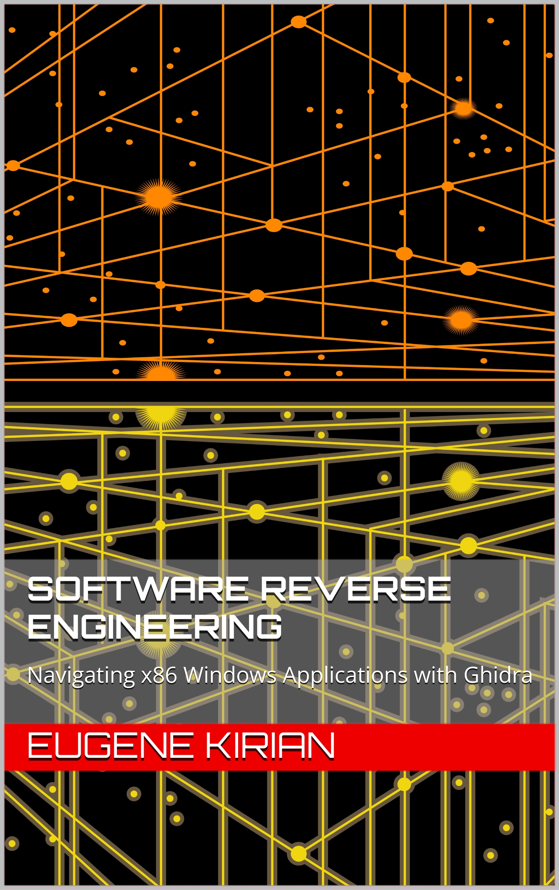

## Software Reverse Engineering
### Navigating x86 Windows Applications with Ghidra

Unlock the secrets of x86 Windows applications with this hands-on guide to software reverse engineering using Ghidra, the industry-leading reverse engineering tool. Through a series of practical examples and in-depth explanations, you'll gain a deep understanding of how to deconstruct and analyze 32-bit Windows applications written in C and C++.

**Mastering Assembly Code and Decompilation Patterns**

Starting with the basics of decompilation and interpretation of simple functions, you'll progress to more advanced topics such as loops, C-style strings, floating-point numbers, and the corresponding assembly instructions and decompiled code patterns in Ghidra. You'll learn how to:
1. Use Ghidra's decompiler and other essential tools for reverse engineering Windows applications.
2. Analyze 32-bit x86 & x87 assembly code, decompile it with Ghidra, and re-engineer the functionality when needed.
3. Understand and interpret C and C++ constructs in assembly and in the decompiled C-like pseudo-code in Ghidra.
4. Work with floating-point numbers using the x87 assembly instruction set, as well as peek into SIMD programming.
5. Reverse engineer C++ classes with and without virtual methods, handle inheritance, including multiple inheritance, and deal with operator overloading.

**Practical Application: Creating a DLL Wrapper**

Take your skills to the next level with a step-by-step guide to creating a dynamically linked library (DLL) wrapper in C and C++ to intercept and modify the behavior of an example application in the runtime. You'll learn how to:

1. Create a DLL wrapper to proxy valid function calls to the original DLL.
2. Use the wrapper to modify the program behavior and data to unlock the example program secrets.

**Advanced Topics and Hands-on Learning**

With its focus on hands-on examples and practical applications, this book is an essential resource for software reverse engineers, security researchers, and anyone looking to gain a deeper understanding of the inner workings of 32-bit Windows applications. Key features include:

1. Practical examples and case studies of reverse engineering C and C++ applications.
2. In-depth coverage of x86 assembly instructions and their relationship to C and C++ constructs.
3. Step-by-step guide to creating a dynamically linked library wrapper for modifying program behavior and data.
4. Coverage of advanced C++ concepts, including operator overloading, exceptions, and multiple inheritance.
5. Focus on hands-on learning and practical applications of reverse engineering, including binary patching.
6. Access to source code and compiled example programs on GitHub.

**Get Started with Numerous Examples**

All source code and compiled versions of example programs are available on GitHub, allowing you to follow along and practice your reverse engineering skills on numerous example applications. By the end of this book, you'll have the skills and confidence to tackle even the most complex reverse engineering challenges and take your understanding of Windows programming to the next level.

***

#### Dependencies

The book relies on the following software:
1. [Microsoft DirectX End-User Runtimes (June 2010)](https://www.microsoft.com/en-us/download/details.aspx?id=8109/)
2. [Microsoft Detours](https://github.com/microsoft/Detours)
3. [Zlib](https://zlib.net/)

***

